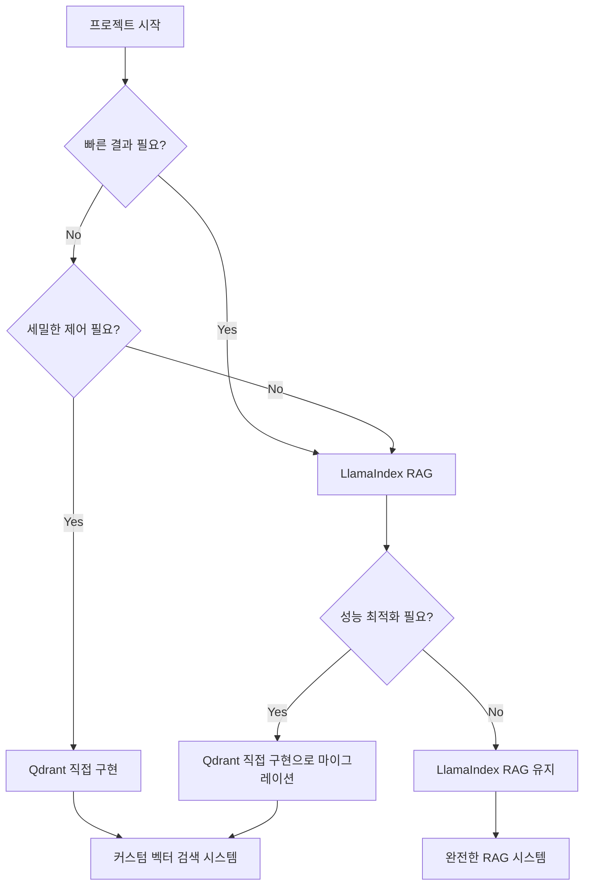

# Qdrant 직접 구현 vs LlamaIndex RAG 완전 비교

## 🎯 핵심 차이점 요약

| 구분 | Qdrant 직접 구현 | LlamaIndex RAG |
|------|------------------|----------------|
| **목적** | 벡터 검색 시스템 구축 | 완전한 RAG 시스템 구현 |
| **복잡도** | 수동 단계별 구현 | 자동화된 파이프라인 |
| **최종 결과** | 유사 문서 리스트 + 점수 | 자연어 최종 답변 |
| **구현 방식** | Low-level API 직접 조작 | High-level 프레임워크 활용 |

---

## 📊 상세 비교 분석

### 1️⃣ **구현 접근 방식**

#### 🔧 Qdrant 직접 구현
```python
# 모든 단계를 수동으로 처리
embeddings = embedding_model.get_text_embedding_batch(texts)
tfidf_matrix = vectorizer.fit_transform(texts)
sparse_indices_list = []  # 희소벡터 수동 처리
client.create_collection(...)  # 컬렉션 수동 생성
client.upsert(...)  # 데이터 수동 업로드
```

#### 🚀 LlamaIndex RAG  
```python
# 간단한 설정으로 자동 처리
Settings.llm = OpenAI(model="gpt-4o-mini")
Settings.embed_model = OpenAIEmbedding(...)
index = VectorStoreIndex.from_documents(documents, storage_context)
```

### 2️⃣ **데이터 처리 방식**

#### 📝 Qdrant 직접 구현
- **수동 벡터화**: OpenAI API 직접 호출
- **수동 희소벡터**: TF-IDF 직접 계산 및 파싱
- **고정 데이터**: 20개 뉴스 데이터 (CSV)
- **메타데이터**: 간단한 category, text만

#### 📚 LlamaIndex RAG
- **자동 벡터화**: Settings로 모델 지정하면 자동 처리
- **자동 청킹**: chunk_size, chunk_overlap 설정으로 자동 분할
- **다양한 데이터 소스**: 
  - 예시 문서 (5개 AI 기술)
  - 위키피디아 (10개 문서)
  - 학사정책 문서 (MD 파일들)
- **풍부한 메타데이터**: title, file_path, creation_date 등

### 3️⃣ **검색 및 결과**

#### 🔍 Qdrant 직접 구현
```python
# 검색 결과: 유사도 점수와 메타데이터
results = client.search(...)
for res in results:
    print(f"{res.payload['category']}: {res.payload['text']} (score: {res.score})")

# 출력 예시:
# 1. 경제: 중소기업 지원 정책 강화 발표 (score: 0.557)
# 2. 정치: 대통령, 신년 기자회견에서 경제 정책 발표 (score: 0.411)
```

#### 🎯 LlamaIndex RAG
```python
# 최종 답변: 자연어로 완성된 답변
response = query_engine.query("휴학은 최대 몇 학기까지 가능한가요?")
print(response)

# 출력 예시:
# "휴학은 최대 6학기까지 가능합니다."

# 근거 확인도 가능
nodes = retriever.retrieve("같은 질문")
# → 답변 근거가 된 5개 문서 조각 반환
```

### 4️⃣ **벡터 저장 방식**

#### 🗄️ Qdrant 직접 구현
```python
# Dense + Sparse 하이브리드
vectors_config={
    "text_dense": models.VectorParams(size=1536, distance=models.Distance.COSINE)
},
sparse_vectors_config={
    "text_sparse": models.SparseVectorParams()
}
```

#### 🗄️ LlamaIndex RAG
```python
# Dense 벡터만 (LlamaIndex가 자동 관리)
# 하이브리드 검색은 별도 설정 필요
vector_store = QdrantVectorStore(client=client, collection_name="academic_policies")
```

---

## 🎭 시나리오별 적합성

### 🔬 **Qdrant 직접 구현이 적합한 경우**

**✅ 언제 사용하나?**
- 벡터 검색 메커니즘을 **세밀하게 제어**하고 싶을 때
- **하이브리드 검색** (Dense + Sparse) 구현이 필요할 때
- **커스텀 벡터화** 로직이 필요할 때
- **검색 성능 최적화**에 집중하고 싶을 때

**🎯 실제 사용 사례:**
- 전문 검색 엔진 개발
- 벡터 DB 성능 벤치마킹
- 커스텀 임베딩 모델 실험
- 검색 알고리즘 연구

### 🚀 **LlamaIndex RAG가 적합한 경우**

**✅ 언제 사용하나?**
- **빠른 프로토타이핑**이 필요할 때
- **종단간 질의응답** 시스템을 구축하고 싶을 때
- **다양한 데이터 소스**를 쉽게 통합하고 싶을 때
- **프로덕션 수준**의 RAG 시스템이 필요할 때

**🎯 실제 사용 사례:**
- 기업 내부 지식베이스 Q&A
- 고객 지원 챗봇
- 학술 논문 검색 시스템
- 정책 문서 질의응답

---

## 🔄 진화 과정

### 1단계: 기초 검색 (Qdrant 직접)
```
질문 → 벡터 검색 → 관련 문서 리스트
```

### 2단계: 완전한 RAG (LlamaIndex)
```
질문 → 벡터 검색 → LLM 생성 → 자연어 답변
```

---

## 💡 핵심 교훈

### 🔧 **기술적 측면**

| 측면 | Qdrant 직접 | LlamaIndex RAG |
|------|-------------|----------------|
| **학습 곡선** | 가파름 (벡터 DB 이해 필요) | 완만함 (추상화된 API) |
| **개발 속도** | 느림 (모든 것 직접 구현) | 빠름 (자동화된 파이프라인) |
| **커스터마이징** | 높음 (모든 것 제어 가능) | 중간 (프레임워크 제약) |
| **디버깅** | 어려움 (많은 수동 단계) | 쉬움 (추상화된 에러 처리) |

### 📈 **비즈니스 측면**

| 측면 | Qdrant 직접 | LlamaIndex RAG |
|------|-------------|----------------|
| **개발 비용** | 높음 | 낮음 |
| **유지보수** | 어려움 | 쉬움 |
| **확장성** | 수동 관리 필요 | 프레임워크가 지원 |
| **팀 온보딩** | 어려움 | 쉬움 |

---

## 🚀 권장사항

### 🎯 **프로젝트 초기**
1. **LlamaIndex RAG**로 빠른 프로토타입 구축
2. 요구사항과 한계점 파악
3. 필요시 **Qdrant 직접 구현**으로 세밀 조정

### 📊 **선택 기준**



### 🎓 **학습 경로**
1. **1단계**: Qdrant 직접 구현으로 **벡터 검색 원리** 이해
2. **2단계**: LlamaIndex RAG로 **실용적 시스템** 구축
3. **3단계**: 두 방식을 **상황에 맞게 선택**하여 활용

---

## 🔮 결론

두 접근 방식은 **상호 보완적**입니다:

- **Qdrant 직접 구현**: 벡터 검색의 **기초 원리**를 이해하고 **세밀한 제어**
- **LlamaIndex RAG**: **실용적인 질의응답** 시스템을 **빠르게 구축**

최적의 전략은 **두 방식 모두 이해**하고, **프로젝트 요구사항에 맞춰 선택**하는 것입니다! 🎯